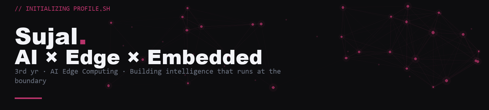
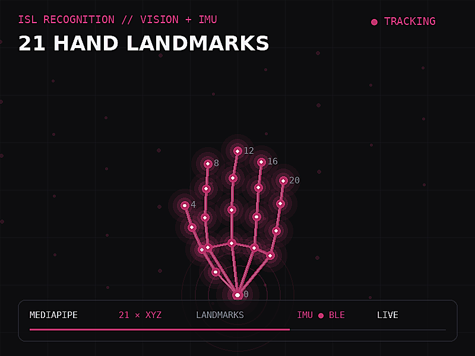
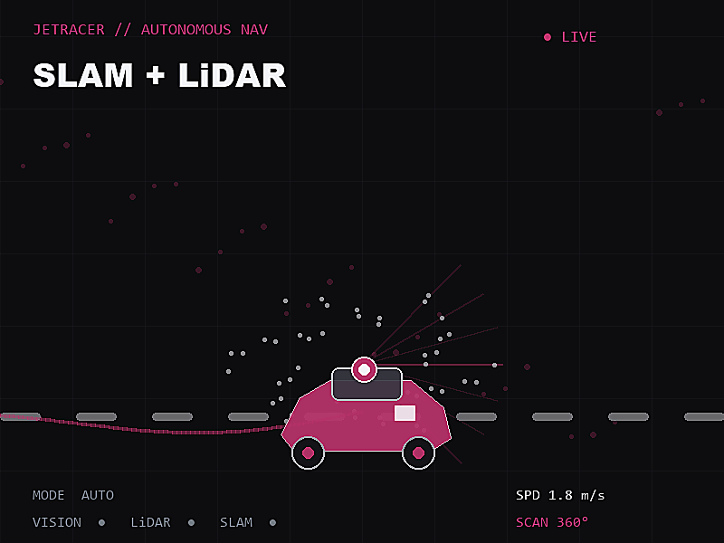

<!--
  ╔══════════════════════════════════════════════════════════╗
  ║  HOW TO USE THIS README                                  ║
  ║  1. Create repo named exactly your GitHub username       ║
  ║  2. Put README.md + banner.gif in the root               ║
  ║  3. Fill in YOUR_GITHUB_USERNAME below (3 places)        ║
  ║  4. LeetCode / LinkedIn links are already filled in      ║
  ╚══════════════════════════════════════════════════════════╝
-->

<!-- ANIMATED HD PROFILE BANNER — keep banner.gif in the repository root -->

  

 

I build systems that run intelligence at the edge — not in the cloud.
From sign language recognition at 8ms on a Pi, to autonomous navigation through fog and rain.
The constraint is the feature.

 

Projects

<table>
<tr>
<td width="50%" valign="top">

🤟 ISL Recognition · Edge AI

Real-time offline Indian Sign Language recognition.
26 gestures · 8ms inference · 200KB INT8 TFLite on Raspberry Pi 4.
Arduino Nano 33 BLE Sense IMU + BLE sensor fusion for J/Z disambiguation.

</td>
<td width="50%" valign="top">

🚗 JetRacer Autonomous Nav   IN DEVELOPMENT

SLAM + LiDAR based navigation for confined spaces and heavy earth movers.
Targeting zero-downtime ops in fog, rain, and low-visibility conditions.

</td>
</tr>
</table>

Skills

Numbers that matter

87.8%

8ms

200KB

25fps

ISL accuracy

Inference latency

Model size (INT8)

Real-time FPS

LeetCode

Connect

&nbsp;

&nbsp;

